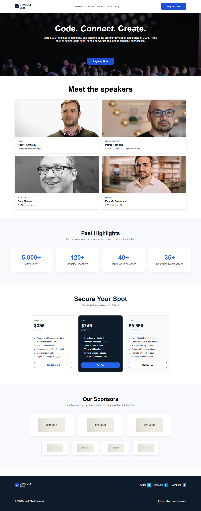

# DevConf 2026 Landing Page

A modern and responsive conference landing page built using **HTML5** and **CSS3**. This project was developed as part of a frontend development assignment by converting a provided **Figma design** into a fully functional website using only HTML and CSS.

## 📸 Preview



---

## 🎨 Design Reference

This project was created by following a provided **Figma design** and recreating it as accurately as possible using only HTML and CSS.

---

## ✨ Features

- Responsive navigation bar
- Hero section with background image and overlay
- Meet the Speakers section
- Past Highlights section
- Pricing plans
- Sponsors section
- Footer with social media links
- Clean and semantic HTML structure
- Modern layouts using Flexbox and CSS Grid
- Smooth hover effects

---

## 🛠️ Technologies Used

- HTML5
- CSS3
- Flexbox
- CSS Grid

> **Note:** This project was built **without JavaScript, Bootstrap, Tailwind CSS, or any other frameworks**. Only HTML and CSS were used.

---

## 📂 Project Structure

```text
DevConf-2026/
│
├── index.html
├── style.css
├── README.md
│
└── assets/
    ├── logo.png
    ├── hero-bg.jpg
    ├── speaker1.jpg
    ├── speaker2.jpg
    ├── speaker3.jpg
    ├── speaker4.jpg
    ├── sponsor1.png
    ├── sponsor2.png
    ├── sponsor3.png
    ├── sponsor4.png
    ├── sponsor5.png
    ├── sponsor6.png
    ├── sponsor7.png
    ├── facebook.png
    ├── twitter.png
    ├── linkedin.png
    └── project-preview.png
```

---

## 📚 Sections Included

- Header / Navigation Bar
- Hero Banner
- Meet the Speakers
- Past Highlights
- Pricing Plans
- Sponsors
- Footer

---

## 📖 What I Practiced

Through this project, I practiced:

- Semantic HTML5
- CSS Flexbox
- CSS Grid
- Responsive layout techniques
- Background images with overlays
- Card-based UI design
- Hover effects and transitions
- Organizing HTML and CSS files
- Converting a Figma design into a real webpage

---

## 🚀 Getting Started

### Clone the repository

```bash
git clone https://github.com/FZ-Fahim/PH-Assignment01.git
```

### Open the project

Navigate to the project folder and open `index.html` in your preferred web browser.

No installation or additional dependencies are required.

---

## 🎯 Assignment Objective

The objective of this assignment was to recreate a provided **Figma landing page design** using only **HTML** and **CSS**.

The project focuses on building clean layouts using Flexbox and CSS Grid while maintaining semantic HTML structure and modern design practices.


## 🌐 Live Demo

```
https://fz-fahim.github.io/PH-Assignment01/
```

---

## 👨‍💻 Author

**Ferdous Zaman**

GitHub: https://github.com/FZ-Fahim
---

## ⭐ Acknowledgements

- Design provided as a **Figma UI assignment**
- Developed using only HTML5 and CSS3
- Icons and images used for educational purposes only